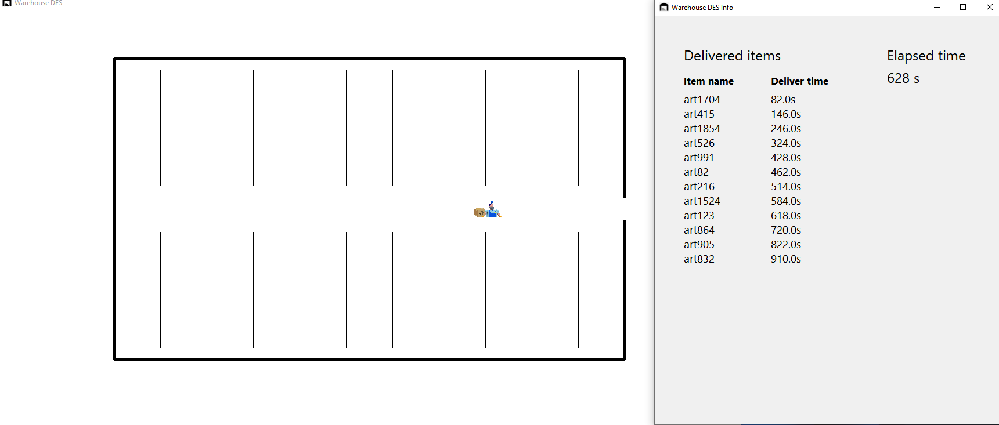

# WareHouse simulation
  

> [!WARNING]
> The code is still a prototype, so it's not functionally working, e.g. the visualized elapsed time doesn't truly correspond to the actual time.

Discrete events simulation of a warehouse including a nice animation of what's happening behind the scenes.

## How to run

If you still need to setup your python environment, chech this [guide](https://github.com/chessparov/chessparov/blob/main/python-setup.md). 

Proceed to install all the packages in the `requirements.txt`, then download the code and run the `Main.py` file.

## Setup and customization

As you may notice when you first run the simulation, the worker is moving very slowly, that's because the simulation is running in real time. To speed it up open the `Variables.py` file and scroll till you find a variable named `FPS` and increase its value. 

Now the worker should be much faster.

Through the `Variables.py` you can tweak the simulation as you like, increase the number of workers (due to the code being still a prototype, you'll still visualize just one though), adequate the distances to real scenarios, adjust the scale for better visualization, ecc...
